<p align="center">
  
</p>

<p align="center">
  
</p>

<p align="center">
  
</p>

<p align="center">
  <a href="https://www.prajwal-priyadarshan.me"></a>
  <a href="https://www.linkedin.com/in/prajwal-priyadarshan"></a>
  <a href="https://leetcode.com/u/F640JVUokd/"></a>
  <a href="mailto:prajwalpriyadarshan@gmail.com"></a>
</p>

---

## About Me

```text
> whoami
Prajwal Priyadarshan G  |  CSE (AI) Undergraduate

> what --do
I build end-to-end software systems: React frontends, backend services and
deployment infrastructure, with async distributed systems, containers,
SQL/NoSQL databases and AI-powered developer tooling in between.

> status
3rd Place Globally · Sarvam AI Track · Hackhazards '26
2 research papers published (MDPI + Springer, 2025)
```

<p align="center">
  
  
  
  
  
  
</p>

---

## Trophy Case

<table align="center">
  <tr>
    <td align="center" width="50%">
      <h3>3rd Place Globally</h3>
      <b>Hackhazards '26</b> · NAMESPACE Community<br/>
      Sarvam AI Track · with Team <b>TetraFourge</b><br/><br/>
      <a href="https://www.namespace.world/credentials/certificates/6ia2No8wVrmd"></a>
    </td>
    <td align="center" width="50%">
      <h3>Top 1% Globally</h3>
      Ranked <b>26th – 50th overall</b><br/>
      out of the global Hackhazards '26 field<br/><br/>
      
    </td>
  </tr>
</table>

---

## Featured Projects

<table>
  <tr>
    <td width="33%" valign="top">
      <h3>Sambhaash AI</h3>
      <sub><b>Distributed Voice-Based Lead Engagement</b></sub><br/><br/>
      End-to-end voice engagement system: client dashboard to a fault-tolerant <b>Twilio</b> backend with real-time <b>STT/TTS</b> pipelines. <b>Redis-backed</b> async queue for lead scoring, retries and dead-letter queues for reliable call recovery.<br/><br/>
      <b>3rd Place Globally · Sarvam AI Track</b><br/><br/>
      
      
      <br/><br/>
      <a href="https://sambhaash-ai.vercel.app/"></a><br/>
      <a href="https://github.com/prajwal-priyadarshan/Sambhaash_AI"></a>
    </td>
    <td width="33%" valign="top">
      <h3>RepoGuardian AI</h3>
      <sub><b>Automated Code Analysis Platform</b></sub><br/><br/>
      Developer productivity platform, React client to <b>FastAPI</b> backend, that analyzes repositories for complexity, structure and maintainability. Integrates the <b>GitHub API</b> and <b>LLMs</b> with PostgreSQL / Supabase schemas.<br/><br/><br/>
      
      
      <br/><br/>
      <a href="https://repo-guardian-ai.vercel.app/"></a><br/>
      <a href="https://github.com/prajwal-priyadarshan/RepoGuardian_ai"></a>
    </td>
    <td width="33%" valign="top">
      <h3>StockSense AI</h3>
      <sub><b>Multi-Agent Investment Analysis</b></sub><br/><br/>
      Containerized multi-agent platform orchestrating <b>technical, fundamental, news and sentiment</b> analysis via <b>LangGraph</b>. FastAPI + PostgreSQL + Redis, Docker deployment and <b>RAG-backed</b> retrieval.<br/><br/><br/><br/>
      
      
      <br/><br/>
      <a href="https://github.com/prajwal-priyadarshan/StockSense-AI"></a>
    </td>
  </tr>
</table>

---

## Tech Arsenal

**Languages**<br/>


**Frontend**<br/>


**Backend & Systems**<br/>


**Databases**<br/>


**AI / ML & GenAI**<br/>


**Tools & DevOps**<br/>


---

## Published Research

| Paper | Venue | Date | |
|---|---|---|---|
| **BESS-Enabled Smart Grid Environments:** A Framework for Cyber Threat Classification, Cybersecurity, and Operational Resilience | *Technologies (MDPI)* | Sep 2025 | [](https://doi.org/10.3390/technologies13090423) |
| **Advancing Short-Term Wind Power Forecasting** by AI-Driven Models for Improved Accuracy | *Electrical Engineering (Springer)* | Aug 2025 | [](https://doi.org/10.1007/s00202-025-03295-1) |

---

## Certifications

| | |
|---|---|
| **Generative AI with Large Language Models** | DeepLearning.AI (Coursera) · [Credential](https://coursera.org/share/a2d67941bafd7f8d185e99a9785e33fd) |
| **Supervised ML: Regression and Classification** | DeepLearning.AI & Stanford Online (Coursera) · [Credential](https://www.coursera.org/account/accomplishments/verify/CYK6LUK2FMIZ) |

---

## Problem Solving

<p align="center">
  
  
  
  
  
  
  
</p>

---

## GitHub Stats

<p align="center">
  
  
</p>
<p align="center">
  
</p>
<p align="center">
  
</p>

---

## Let's Build Something

<p align="center">
  <a href="https://www.prajwal-priyadarshan.me"></a>
  <a href="https://www.linkedin.com/in/prajwal-priyadarshan"></a>
  <a href="https://github.com/prajwal-priyadarshan"></a>
  <a href="https://leetcode.com/u/F640JVUokd/"></a>
  <a href="mailto:prajwalpriyadarshan@gmail.com"></a>
</p>

<p align="center">
  
</p>

<p align="center">
  
</p>
